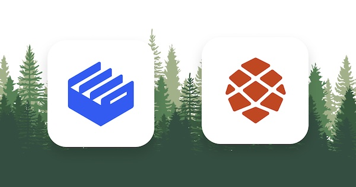

# Redwood Tutorial App with Clerk

  

This repo is based on a fork of the official [Redwood Tutorial repo](https://github.com/redwoodjs/redwood-tutorial) and represents the final state of the app created during the [Redwood Tutorial](https://redwoodjs.com/tutorial) with the addition of Clerk as the authentication provider.

You can follow along with [this guide](https://clerk.dev/tutorials/redwoodjs-tutorial-with-clerk) to integrate Clerk with RedwoodJS. You can also use this repo as the basis for further exploration with Redwood. Happy trails! 🌲

## Contact

If you need support or have anything you would like to ask, please reach out on our [Discord channel](https://discord.com/invite/b5rXHjAg7A). We'd love to chat!

